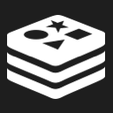
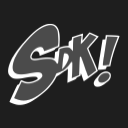
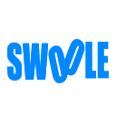
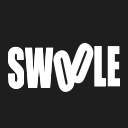
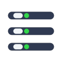
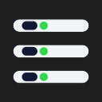
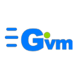
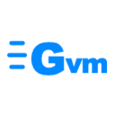
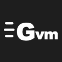

# AppIcons

MacEnv 用到的全部图标：**源 SVG** + **128×128 渲染图**。

```
AppIcons/
├── README.md
├── svg/    源文件，从 MacEnv/Assets.xcassets/*.imageset 原样复制，未做任何改动
├── png/    128×128 渲染图，每个图标两张：亮色版（蓝）+ 暗色版（白）
└── tile/   96×96 展示图块：圆角方形轮廓 + 图标 + 名字，根目录 README 用
```

> 下面这张表是**放大看**用的：每个图标 128 px、一屏只放几个。
> 要一眼看全，看根目录 README 的「图标」一节（引用的是 `tile/` 里的图块，22 个图标 × 明暗两套）。
> 图块的圆角方形轮廓是**烘焙进 PNG 的**，不是 CSS —— GitHub 的 HTML sanitizer 会剥掉 `style` 属性
> （`html-pipeline` 的 `SanitizationFilter` 白名单里没有 `style`），`border-radius` 在 README 里用不了。

## 渲染参数

| 项 | 值 | 出处 |
| --- | --- | --- |
| 尺寸 | 128 × 128 | 图标按比例缩到 112 × 112 居中，四周留 8 px |
| 渲染引擎 | CoreSVG（`NSImage`） | 跟 asset catalog 同一个解码器 —— 所见即 app 所得，不是浏览器渲染的近似效果 |
| 亮色版前景 | `#0088FF` | `NSColor.systemBlue` 浅色主题实测值 |
| 亮色版底色 | `#FFFFFF` | `AppTheme.panelBackground`（`textBackgroundColor`）浅色值 |
| 暗色版前景 | `#FFFFFF` | 深色主题下前景色由 `.blue` 换成 `.white` |
| 暗色版底色 | `#1E1E1E` | `textBackgroundColor` 深色值 |

**两种渲染方式，别混**：

- **template（绝大多数）** —— app 里走 `Image(...).renderingMode(.template)`，颜色维度被整个丢掉，
  只拿 alpha 当遮罩填主题色。所以**源 SVG 本身是彩色的也没用**，这里渲染出来的就是 app 里的样子。
- **original（Homebrew、菜单栏）** —— 保留 SVG 自带的硬编码配色，浅色深色各一套文件。

---

## Web 服务

| 图标 | 亮色版（蓝） | 暗色版（白） |
| --- | :-: | :-: |
| **Nginx** |  |  |

## 数据库与缓存

| 图标 | 亮色版（蓝） | 暗色版（白） |
| --- | :-: | :-: |
| **MySQL** |  |  |
| **MariaDB** |  |  |
| **Redis** |  |  |

## 语言运行时

| 图标 | 亮色版（蓝） | 暗色版（白） |
| --- | :-: | :-: |
| **PHP** |  |  |
| **Go** |  |  |
| **Java** |  |  |

## 构建工具

| 图标 | 亮色版（蓝） | 暗色版（白） |
| --- | :-: | :-: |
| **Maven** |  |  |
| **Gradle** |  |  |

## 包管理 / 环境工具

| 图标 | 亮色版（蓝） | 暗色版（白） |
| --- | :-: | :-: |
| **Homebrew**<br><sub>original 渲染，自带双色</sub> |  |  |
| **MacPorts** |  |  |
| **SDKMAN** |  |  |
| **Composer** |  |  |
| **Swoole CLI** |  |  |

## 界面图标

| 图标 | 亮色版（蓝） | 暗色版（白） |
| --- | :-: | :-: |
| **环境工具**<br><sub>侧栏「控制台」组</sub> |  |  |
| **SSL 证书**<br><sub>侧栏「站点」</sub> |  |  |
| **快捷启动**<br><sub>控制台首项</sub> |  |  |
| **菜单栏**<br><sub>original 渲染，自带双色</sub> |  |  |

---

## GVM · 三套字标

GVM 一共三套字标，前两套是我们自己的设计，第三套是上游原版素材。都比其他图标多渲染了几个变体。

### 第一套 · 矢量字标（app 正在用）

`svg/gvm.svg` —— 纯路径画的圆角字标，方形画布 486.1 × 486.1，单色剪影。
app 里走 `GvmIcon` 的 template 渲染，浅色蓝、深色白自动跟主题。

| 亮色版（蓝） | 暗色版（白） |
| :-: | :-: |
|  |  |

### 第二套 · 字体字标（2 个色彩版 + 1 个单色版）

`svg/gvm-wordmark-color-light.svg` / `gvm-wordmark-color-dark.svg` / `gvm-wordmark-solid.svg`
—— 用 `Arial Black` 拼的字（三条 `rect` 速度线 + `<text>G</text>` + `<text>vm</text>` + 绿点），
方形画布 333 × 333。**色彩版自带配色**，速度线和 G 是蓝的、绿点固定 `#91D300`；深色版把 vm 转白。

**色彩版**

| 亮色版（蓝 G + 绿点） | 暗色版（蓝 G + 白 vm + 绿点） |
| :-: | :-: |
|  |  |

**单色版**

| 亮色版（蓝） | 暗色版（白） |
| :-: | :-: |
|  |  |

> 单色版没有绿点（原设计就没有），所以 template 渲染出来是一整块纯色。

### 第三套 · 渐变原版字标（上游素材）

`svg/gvm-logo-light.svg` / `gvm-logo-dark.svg` —— 上游原版字标，**横向 502 × 224**。
G 和三条速度线是 teal 渐变（`#70E5E7` → `#1BB6D4`），vm 跟主题走：
浅色版深灰 `#3C3C43`，深色版近白 `#EBF7FF`。original 渲染，自带配色。

| 亮色版（深灰 vm） | 暗色版（近白 vm） |
| :-: | :-: |
|  |  |

> 宽高比 2.24 : 1，塞进方形画布后上下留白多 —— 是比例决定的，不是渲染问题。
> 要它撑满，得先做方形化重排（或改用上面两套方画布的设计）。

---

## 备注

- 图标在 app 里显示尺寸是 **22 × 22 pt**，128 px 是放大看细节用的。
- 有几个图标**在 app 里就是"糊成一团"的**，不是渲染坏了 —— SDKMAN、Composer 这类官方 logo
  细节密度高，压成单色剪影后本来就只剩个轮廓。要改就得单独重构几何（像 Homebrew 那样），
  不能靠换渲染方式解决。
- `svg/` 里的文件是**只读参考**。真正生效的是 `MacEnv/Assets.xcassets/*.imageset/`，
  改图标要改那边，别改这里。
