# MacEnv

macOS 上的本地开发环境管理器。用 SwiftUI 画界面、AppKit 管窗口与菜单栏、Foundation 的 `Process` 托管服务进程，一个窗口把本机的 Nginx、MySQL、MariaDB、PostgreSQL、Redis、ClickHouse、Qdrant、Consul、etcd、PHP、Go、Java、Python 管起来。

## 界面预览

### 浅色主题

环境工具与 Go 版本管理，安装来源、版本与运行状态一目了然。

<div align="center">
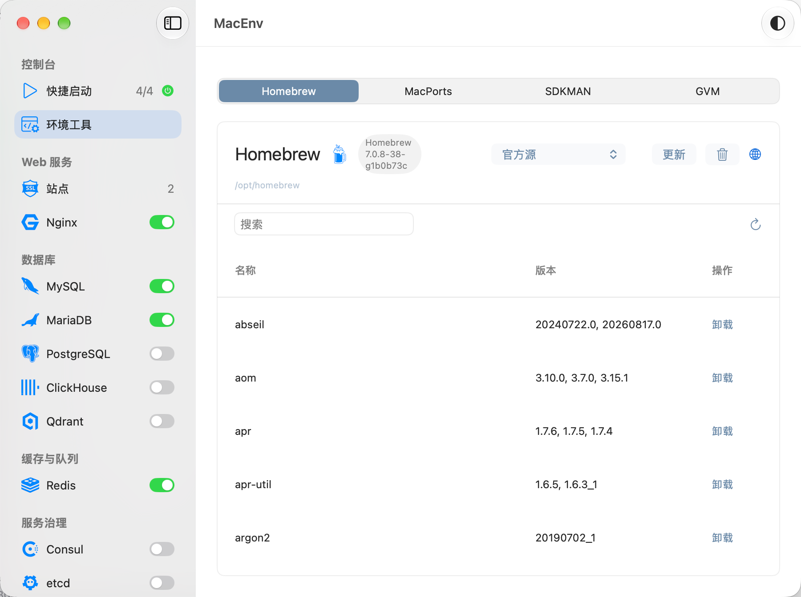
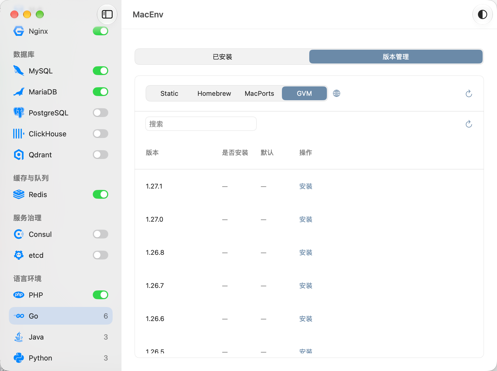
</div>

### 深色主题

快捷启动与 PHP-FPM 管理，常用服务一键启停，多版本独立运行。

<div align="center">
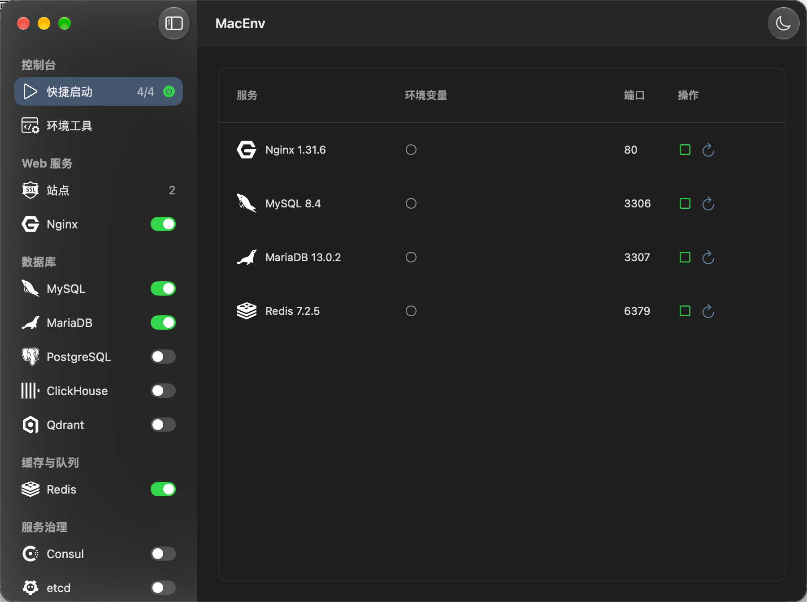
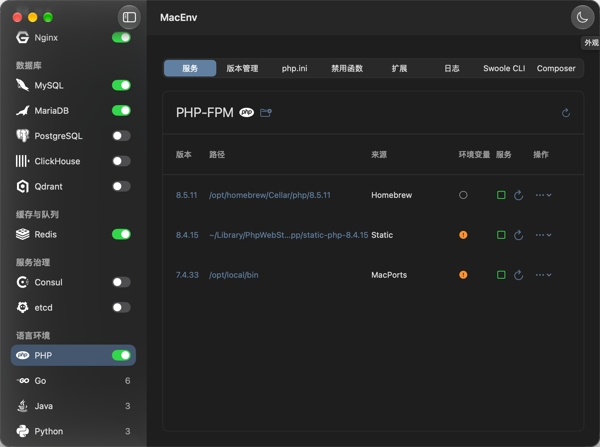
</div>

### 菜单栏

从菜单栏查看服务状态、一键启停，并快速回到主界面。

<div align="center">
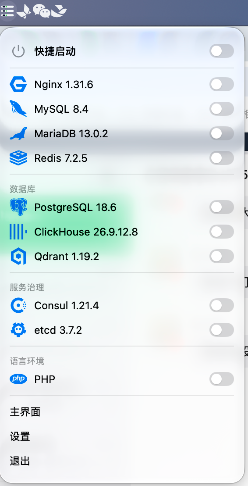
</div>

## 功能

### 快捷启动

把常用的服务版本勾进来，侧栏的电源键一键全部启动或全部停止，侧栏那一行实时显示「在跑 / 总数」。Nginx 启动成功后会自动把所有 PHP-FPM 版本一起拉起来 —— 站点离不开 FPM。

### 站点

- 站点列表：域名、别名、路径、端口、PHP 版本、SSL 状态
- 新建站点时按目录特征自动识别 WordPress、Laravel、Yii、ThinkPHP 并填入伪静态规则；Laravel、Yii、ThinkPHP 的根目录会自动下探到 `public` / `web`
- 反向代理：按路径前缀转发到上游地址，一个站点可以配多条
- Park：选一个目录，它下面的每个子目录自动展开成一个站点
- 自签 HTTPS：首次使用自动生成根 CA 并装进系统钥匙串，之后按站点签发证书
- 系统 hosts：按标记块整块写入 `/etc/hosts`，标记块以外的内容原样保留
- 站点日志、vhost 配置文件都可以在界面里直接查看和编辑

### Nginx

服务、版本、配置、错误日志、访问日志五个页签。版本来源覆盖 Homebrew、MacPorts、静态包和自定义目录，支持启动、停止、重启、重载和配置校验。

### MySQL / MariaDB

服务、版本、配置、错误日志、慢日志五个页签。首次启动自动初始化数据目录并设置 root 密码，两个服务的默认端口错开，可以同时运行。

### PostgreSQL

服务、版本、配置、日志四个页签。配置、数据、日志和密码口令全在 `initdb` 生成的数据目录里，MacEnv 不另外写一份配置文件 —— 这是 PostgreSQL 生态认的布局。版本来源覆盖 Homebrew、MacPorts 与自定义目录，默认端口 5432。

### Redis

服务、版本、配置、日志四个页签。版本来源覆盖 Homebrew、MacPorts 与自定义目录。`redis-server` 会把自己的进程标题改写成 `redis-server *:6379`，认领进程时不能只看可执行文件名，MacEnv 用 PID、内核记录的可执行路径和启动时间核对进程归属，并保留启动记录。

### ClickHouse

服务、版本、配置、日志四个页签。配置页在 `config.xml` 与 `users.xml` 之间切换，首次启动自动生成这两份配置并建好 `root` 超级用户。版本来源只有静态包与自定义目录 —— 官方只发 cask，Homebrew 的公式接口查不到，MacPorts 也没有 port。默认端口 8123（HTTP）与 9000（TCP）。

### Qdrant

服务、版本、配置、日志四个页签。跟 ClickHouse 一样只有静态包与自定义目录两条来源。配置、数据、快照与日志保存在 MacEnv 的服务目录内，独立于安装包。

### Consul

服务、版本、配置、日志四个页签。配置按主版本分文件（raft 存储格式跨大版本不兼容），端口、数据目录、日志路径全部写在 JSON 里，界面读它显示。版本来源覆盖静态包、MacPorts 与自定义目录，默认端口 8500（HTTP API）与 8600（DNS）。

### etcd

服务、版本、配置、日志四个页签。配置按主版本分 YAML 文件，`listen-client-urls` / `listen-peer-urls` 里写的端口就是界面上显示的端口。版本来源覆盖 Homebrew、静态包与自定义目录 —— MacPorts 没有 `etcd` 这个 port。默认端口 2379（客户端）与 2380（节点间通信）。

### PHP

服务、版本、php.ini、禁用函数、扩展、日志、Swoole CLI、Composer 八个页签。

- PHP-FPM 每个大版本与小版本组合（如 8.4、8.5）各用一个独立 master 和 socket；同组切换补丁版本时先停止旧实例，不同组可以同时运行，站点按需选用
- 扩展管理支持 Homebrew 的 `shivammathur/extensions` tap 与 MacPorts 两种来源，能区分「已安装未启用」和「已启用」
- 禁用函数列表 = 内置清单 ∪ 自定义 ∪ php.ini 里已写着的，勾选后直接写回 php.ini
- Swoole CLI 与 Composer 作为自包含运行时一起管理，装好即可用

### Go

已安装、版本、GVM 三个页签。版本来源覆盖静态包、自定义目录、系统常见落点（`/usr/local/go`、Homebrew、MacPorts、`~/sdk/go*`、`~/go/go*`）以及 GVM 装的版本。

### Java / Maven / Gradle

Java 是「已安装 + 版本管理 + Maven + Gradle」四个页签，后两个与 Java 同构。

- JDK 的版本与发行商直接读 `<Home>/release`，不起进程；来源覆盖静态包、Homebrew、MacPorts、SDKMAN 与自定义目录
- 环境变量开关会顺带 `export JAVA_HOME` —— mvn / gradlew 启动先读它，只改 PATH 的话它们用的还是系统里版本最高的那个 JDK
- Maven / Gradle 的版本来源是静态包、Homebrew、MacPorts、SDKMAN 四条渠道

### Python

已安装、版本管理两个页签，跟 Go 一样属于「不需要启动服务」的模块。版本来源覆盖静态包（python-build-standalone）、Homebrew、MacPorts、python.org 官方安装器，以及系统自带的 `/usr/bin/python3`。

- 启用某个版本时写入 PATH 的是 MacEnv 自己造的 shim 目录，不是 Python Home —— Homebrew 的 keg 里 `bin/` 只有 `python3`、`libexec/bin/` 只有 `python`，MacPorts 更是直接在打包时删掉了 `bin/python3`，没有任何一个目录能同时提供这两个名字
- shim 按版本隔离（目录名带版本与路径摘要），切换版本时软链目标跟着变，界面才能判出当前启用的是哪一个
- 版本号跑一次 `--version` 读出来，Python 2 把结果写到 stderr 也能解析

### 版本与 PATH

- 版本来源：Homebrew、MacPorts、MacEnv 下载安装的静态包、用户自己加的目录，以及登录 shell 的 `PATH` 里出现过的目录
- 每个版本一个环境变量开关，开启后写入 MacEnv 的软链接目录并注入 shell 配置区块
- 支持 zsh、bash、fish 以及其他 POSIX shell；改动用户的 shell 配置前会先备份，只保留最近 5 份
- 命令别名：给任意版本的可执行文件起一个短名字，写进 `PATH`

### 设置

- 通用：外观（跟随系统 / 浅色 / 深色）、语言、开机启动、关闭窗口时隐藏、启动时自动拉起服务、代码字号
- 开发者：Homebrew 源、静态包服务地址、网络代理、打开数据目录
- 模块：按分组开关侧边栏条目，分组标题旁的开关可以一键全开或全关

界面提供简体中文、繁体中文、English、日本語四种语言，可以跟随系统。

## 图标

MacEnv 用到的全部图标。浅色主题是蓝色、深色主题是白色，跟随系统外观自动切换：绝大多数图标是单色剪影，颜色由主题色决定；Homebrew、菜单栏和 GVM 字标自带配色，浅色深色各一套文件。

<div align="center">
<p><strong>浅色主题 · 蓝色图标</strong></p>
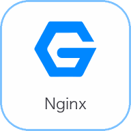
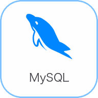
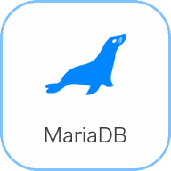
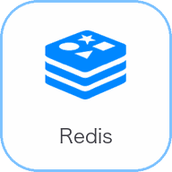
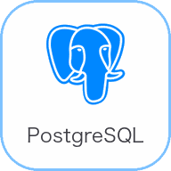

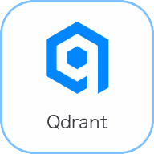

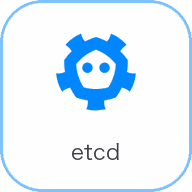

<br>

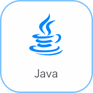
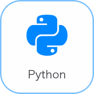
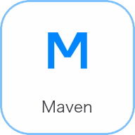


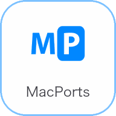
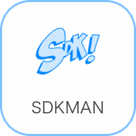

<br>
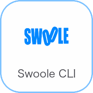
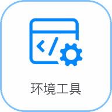


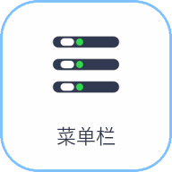


<p><strong>深色主题 · 白色图标</strong></p>
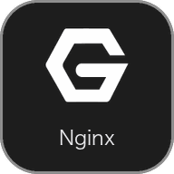
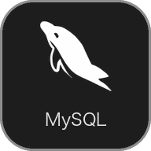
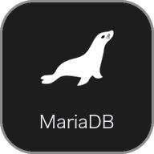
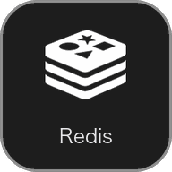
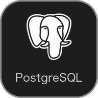

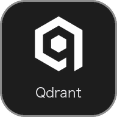
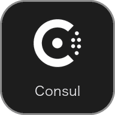
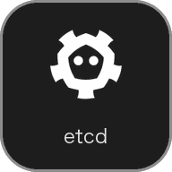
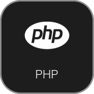
<br>

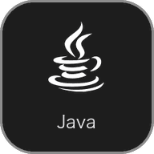
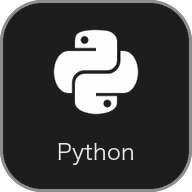
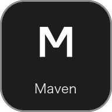


<br>
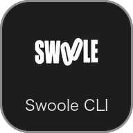
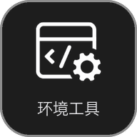
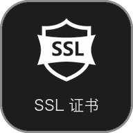

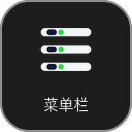


</div>

源 SVG 与 128 × 128 渲染图在 [`AppIcons/`](AppIcons/)，逐个图标的完整清单和渲染说明见那边的 README。

## 环境要求

- macOS 13 或更高版本
- Xcode（需要完整的 SwiftUI SDK）
- 可选：Homebrew，用于检测和安装 Homebrew 版本的服务

## 安装

从 Releases 页面按芯片挑一个包下载，连同它对应的 `.sha256` 校验文件：

| 芯片 | 下载 |
| --- | --- |
| Apple Silicon（M 系列） | `MacEnv-arm64.zip` |
| Intel | `MacEnv-x86_64.zip` |

拿不准就看「关于本机」里的「芯片」一行。解压后把 `MacEnv.app` 拖进「应用程序」。想确认下载完整，先校验再解压：

```sh
shasum -a 256 -c MacEnv-arm64.zip.sha256
```

发布包是 ad-hoc 签名的，没有 Apple Developer ID 证书，也没有经过公证。首次打开时 Gatekeeper 会拦下来：轻则提示「无法验证开发者」，重则直接说「已损坏，无法打开」。这是未签名应用被拦下的正常表现，不是文件真的坏了。按下面任意一种方式放行，只需做一次，之后双击就能开：

- **命令行**（最省事，也最管用）：`xattr -cr /Applications/MacEnv.app`
- **系统设置**：打开「系统设置」→「隐私与安全性」，在下方找到被拦下的那条提示，点「仍要打开」
- **右键打开**：在 Finder 里右键 `MacEnv.app` → 「打开」→ 弹窗里再点一次「打开」。报「已损坏」时这条路常常走不通，那就用上面两条

**不要**用 `sudo spctl --master-disable` 去关 Gatekeeper。那一条是全局生效的，会让整台机器对**所有**应用都失去来源检查，为了装一个本地开发工具不值当。

从源码自己构建的产物同样是 ad-hoc 签名，用上面任一方式打开即可。

## 构建和运行

```sh
./scripts/check-macos-build.sh    # 语法与工具链检查
./scripts/test-macos-app.sh       # 运行单元测试
./scripts/build-macos-app.sh      # 构建产物并校验资源
open build/Products/Debug/MacEnv.app
```

产物路径：`build/Products/Debug/MacEnv.app`

### 产物体积与架构

| 配置 | 架构 | 体积 |
| --- | --- | --- |
| Debug | arm64（本机架构） | 约 9.5 MB |
| Release | 单架构（arm64 或 x86_64） | 约 6.8 MB |
| Release | 通用二进制（arm64 + x86_64） | 约 12 MB |

Debug 通过 `ONLY_ACTIVE_ARCH = YES` 只编本机架构，构建更快、产物更小，只能在同架构的 Mac 上运行。Release 不指定 `ARCHS` 时默认编通用二进制，Apple Silicon 和 Intel 都能跑；用 `ARCHS` 定死一个架构就只出那一个 —— 发布时那两个包就是这么来的：

```sh
xcodebuild -project MacEnv.xcodeproj -scheme MacEnv -configuration Release \
  -derivedDataPath build/DerivedData-arm64 ARCHS=arm64 ONLY_ACTIVE_ARCH=NO \
  OTHER_SWIFT_FLAGS='-Xfrontend -disable-sandbox' CODE_SIGN_IDENTITY=- build
```

在 Apple Silicon 上编 x86_64 走的是交叉编译，只编译不跑测试，所以不用另找一台 Intel 机器。把上面命令里的 `arm64` 换成 `x86_64` 就是另一个包。

产物体积的大头是可执行文件（单架构 5.4 MB，通用二进制 10.8 MB），资源只占约 1.4 MB（图标、四个语言包、Nginx / PHP / 站点模板）。打包出来单架构约 2.6 MB，通用二进制约 3.9 MB。

## 发布

推一个 `v*` 的 tag 就会触发 `.github/workflows/release.yml`：在 macOS runner 上按 `arm64`、`x86_64` 各构建一次，校验产物资源和可执行文件架构，分别打包成 `MacEnv-arm64.zip` 与 `MacEnv-x86_64.zip`，算出各自的 SHA-256，然后挂到对应的 Release 上。发布前同步 `MacEnv/Info.plist` 的版本号，tag 的注解消息就是 Release 的更新说明。

runner 是 arm64 机器，x86_64 那一份是交叉编译出来的。只编译、不跑测试，所以不需要再开一台 Intel runner。

```sh
git tag -a v1.1.2
git push origin main v1.1.2
```

workflow 也支持手动触发，手动跑只编译不发布，用来验证流程本身。

## 目录结构

```text
MacEnv/
├── MacEnv.xcodeproj/      # Xcode 工程：target、文件清单、编译参数、scheme
├── MacEnv/
│   ├── App/               # 入口与生命周期（@main + AppDelegate + 菜单栏）
│   ├── Views/             # SwiftUI 界面
│   ├── ViewModels/        # 状态持有与动作编排
│   ├── Services/          # 进程、命令、HTTP、文件 IO
│   ├── Models/            # 数据结构、本地化与公共辅助
│   ├── Resources/         # 运行时资源：四个 .lproj、NginxDefaults、PhpDefaults、HostDefaults、RewriteDefaults、菜单栏图标
│   ├── Assets.xcassets/   # 应用图标与服务图标
│   └── Info.plist
├── Tests/MacEnvTests/     # 单元测试
├── Design/                # 应用图标的设计稿与源文件
├── AppIcons/              # 图标源 SVG、渲染图、圆角图块与 screenshots/ 界面截图
├── scripts/               # 构建、测试与检查脚本
└── .github/workflows/     # 自动发布流程
```

`MacEnv.xcodeproj` 是构建定义，`MacEnv/` 是源码。GUI 应用走 Xcode 工程这一条路 —— SwiftPM 出不了 `.app` bundle，也处理不了 Info.plist、entitlements、图标和代码签名，所以仓库里只有一套构建定义。

## 数据目录

```text
~/Library/Application Support/MacEnv/
├── server/nginx/common/          # Nginx 配置、日志、PID
│   ├── conf/nginx.conf
│   ├── conf/nginx.conf.default
│   └── logs/
├── server/nginx/versions/        # 静态包安装的 Nginx
├── server/mysql/                 # MySQL 配置、数据目录、日志
├── server/mariadb/
├── server/postgresql/            # PostgreSQL 的 postgresql.pid、data-<主版本>/（initdb 生成配置、数据、日志）、versions/
├── server/clickhouse/            # ClickHouse 的 config.xml / users.xml、数据目录、日志
├── server/qdrant/                # Qdrant 的配置、数据、快照、日志与 versions/
├── server/redis/                 # Redis 的 redis-<主版本>.conf、db-<主版本>/、日志
├── server/consul/                # Consul 的 JSON 配置、数据目录、日志、PID
├── server/php-fpm/<两位版本>/     # 每个 PHP 版本的 FPM 配置、日志、运行目录
├── server/golang/versions/       # 静态包安装的 Go
├── server/java/versions/         # 静态包安装的 JDK
├── server/python/versions/       # 静态包安装的 Python
├── server/swoole-cli/versions/
├── server/composer/versions/
├── vhost/                        # 站点 vhost、伪静态、日志
├── CA/                           # 自签根 CA 与站点证书
├── env/                          # MacEnv 管理的 PATH 软链接
├── shims/python/                 # Python 的 python / python3 / python3.x 名字补全
├── alias/                        # 命令别名脚本
├── backup/                       # 用户 shell 配置的备份
├── cache/                        # 下载的安装包
├── catalog/                      # 静态版本清单缓存
├── host.json                     # 站点配置
└── quick-start.json              # 快捷启动配置
```

## 设计取向

- 服务由 MacEnv 自己托管前台进程，退出应用时全部停掉；不注册 LaunchAgent，不在系统设置的后台项目里留条目
- 系统文件只写 `/etc/hosts` 的 MacEnv 标记块，以及用户 shell 配置文件里的 MacEnv PATH 区块
- 数据库 root 密码固定为 `root`，适配本地开发场景
- MySQL 默认 3306、MariaDB 默认 3307，两个服务可以同时运行
- 安装包来源为官方镜像与 GitHub Release

## 许可证

MIT，见 `LICENSE`。
